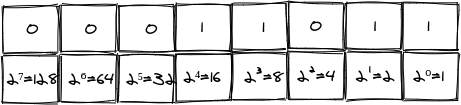

# Using Bitmasks

You write a server for a massively multiplayer online role-playing game ([MMORPG](https://en.wikipedia.org/wiki/Massively_multiplayer_online_role-playing_game)).

In the game, players collect keys and you want to design how to store the set of keys each player has.

As an example, imagine the set of keys are `copper`, `jade` and `crystal`. You consider the following options for storing a player key set:

- A `[]string`
- A `map[string]bool`

Both options will work, but did you consider a third option of using a [bitmask](https://en.wikipedia.org/wiki/Mask_(computing)). Using a bitmask will make storing and processing keys more efficient. Once you learn the mechanics, it will be readable and maintainable as well.

Let’s see how.

## Interlude: Numbers as Bits

Let’s start off with the understanding that computers store numbers as a sequence of 8 bits called a byte, where every byte represents a number.

Every bit represents a “power of two” number. The first bit (called LSB - least significant bit) is 20 = 1, the second is 21 = 2 and so fourth until the last (called MSB = most significant bit) which is 27 = 128.


When we want to represent a number, say 27. We break it to powers of two.
27 = 1(2⁰) + 2(2¹) + 8(2³) + 16(2⁴)

We set the bits in the positions we use to 1, making the binary representation of 27 in binary is to 00011011.




The highest number we can represent in a single byte is: 1+2+4+8+16+32+64+128=255

_Note: A fun exercise with kids is to teach them to count up to 31 on one hand. Each finger is a bit, where the pinky is 1 and the thumb is 16. Let them giggle at 4 :)_

We also define logic operations on bits:

AND (`&`) is true only if two bits are 1: 
- `0 & 0 -> 0`
- `0 & 1 -> 0`
- `1 & 0 -> 0`
- `1 & 1 -> 1`

OR (`|`) is true if one of the bits is 1:
- `0 | 0 -> 0`
- `0 | 1 -> 1`
- `1 | 0 -> 1`
- `1 | 1 -> 0`

_Note: The bitwise or is different than the "or" we use in English which means either the first bit is 1 or the second. The operator for the English "or" is known as XOR (short for eXclusive OR)._

NOT (`^`) negates the bit
- `^1 -> 0`
- `^0 -> 1`

These operators work on more than one bit at a time. To calculate 5&3 do the following:
- Represent them as bits: 5 -> 00000101, 3 -> 00000011
- Calculate AND between bits in the same position

```
00000101
00000011
--------
00000001
```

Which means that `5&3 = 0`.

SHIFT LEFT (`<<`) moves all bits one to the left.

```
00001010 << 1 -> 00010100
```

Shifting left one place is like multiplying by 2.

Using these operators we can do pretty complex logic. In our case we'll use them to set/unset bits and check if a bit is set.

## Back to Our Keys

We need to support 3 keys, which means we need only 3 bits. However the smallest type we can use is a single `byte` which is 8 bits.

**Listing 1: Key type**
```
8 // Key is a key in the game
9 type Key byte
```

On line 9, we define the `Key` type as a bit (which is an alias to `uint8`)

**Listing 2: The Keys**

```
11 const (
12     Copper  Key = 1 << iota // 1
13     Jade                    // 2
14     Crystal                 // 4
15     maxKey
16 )
```

Listing 2 shows the available keys. On line 11, we start to define our keys. Using `iota` in the same `const` group will increment it automatically. On line 12, we define the value for the first key as `1 << iota` which is `1 << 0 = 1`. On line 13, `Jade` will have the value of `1 << 2 = 2`... On line 15, we define `maxKey` which is the maximal key value, this value is not exported.

In order to have nice string representation for our keys, we'll have it implement the [fmt.Stringer](https://golang.org/pkg/fmt/#Stringer) interface.


**Listing 2: String() implementation**

```
18 // String implements the fmt.Stringer interface
19 func (k Key) String() string {
20     if k >= maxKey {
21         return fmt.Sprintf("<unknown key: %d>", k)
22     }
23 
24     switch k {
25     case Copper:
26         return "copper"
27     case Jade:
28         return "jade"
29     case Crystal:
30         return "crystal"
31     }
32 
33     // multiple keys
34     var names []string
35     for key := Copper; key < maxKey; key <<= 1 {
36         if k&key != 0 {
37             names = append(names, key.String())
38         }
39     }
40     return strings.Join(names, "|")
41 }
```

Listing 3 shows the `String() string` method implementation. On line 20, we check that the value is valid. On lines 24 to 31, we return string value for a single key (bit) and on lines 34 to 40, we construct a string representation for multiple keys (bits).

Now we're ready to use `Key` in our `Player` struct.

**Listing 4: Player struct**

```
43 // Player is a player in the game
44 type Player struct {
45     Name string
46     Keys Key
47 }
```

Listing 4 shows the `Player` struct implementation. On line 45, we have the player name and on line 46, we have the set of keys it holds. As the game is developed, we'll add more fields.

**Listing 5: Adding a key**

```
49 // AddKey adds a key to the player keys
50 func (p *Player) AddKey(key Key) {
51     p.Keys |= key
52 }
```

Listing 5 shows adding a key. On line 51, we use bitwise OR to set the `key` bit in the `Keys` field.

**Listing 6: Checking for a Key**

```
54 // HasKey returns true if player has a key
55 func (p *Player) HasKey(key Key) bool {
56     return p.Keys&key != 0
57 }
```

Listing 6 shows checking for a key. On line 56, we use bitwise AND to check if the key bit is set in the `Keys` field.

**Listing 7: Removing a Key**

```
59 // RemoveKey removes key from player
60 func (p *Player) RemoveKey(key Key) {
61     p.Keys &= ^key
62 }
```

Listing 7 shows removing a key. On line 61, we first use bitwise NOT to flip the `key` bits and then use bitwise AND to unset the key bit in the `Keys` field.

## Conclusion

Go's type system allows you to combine low level code such as bitmasks with high level code such as methods to give you both performance and user friendly code.

How much did we save? I wrote [a benchmark](https://github.com/353words/bitmask/blob/master/bench_test.go) that checks the three approaches: using a `[]string`, using a `map[string]bool` and using our `byte` based implementation.

**Listing 8: Running the benchmark**

```
01 $ go test -bench . -benchmem
02 goos: linux
03 goarch: amd64
04 pkg: github.com/353words/bitmask
05 cpu: Intel(R) Core(TM) i7-7500U CPU @ 2.70GHz
06 BenchmarkMap-4      	249177445	         4.800 ns/op	       0 B/op	       0 allocs/op
07 BenchmarkSlice-4    	243485120	         4.901 ns/op	       0 B/op	       0 allocs/op
08 BenchmarkBits-4     	1000000000	         0.2898 ns/op	       0 B/op	       0 allocs/op
09 BenchmarkMemory-4   	21515095	        52.25 ns/op	      32 B/op	       1 allocs/op
10 PASS
11 ok  	github.com/353words/bitmask	4.881s
```

Listing 8 shows the results of the benchmark on my machine. On line 1, we run the benchmark with the `-benchmem` flag to benchmark memory allocations. On lines 06-09, we see that our `byte` based implementation is about 16 times faster than the alternatives. On line 09, we see that allocating `[]string{"copper", "jade"}` consumes 32 bytes, which is 32 times more memory than our single byte implementation.

_Note: You should optimize *only* after you have performance requirements and you have profiled your application. See the [Rules Of Optimization Club](https://wiki.c2.com/?RulesOfOptimizationClub) for more great advice._

What tricks did you use to reduce memory? I'd love to hear your stories, ping me at miki@353solutions.com
The code for this blog post can be found [on GitHub](https://github.com/353words/bitmask).


